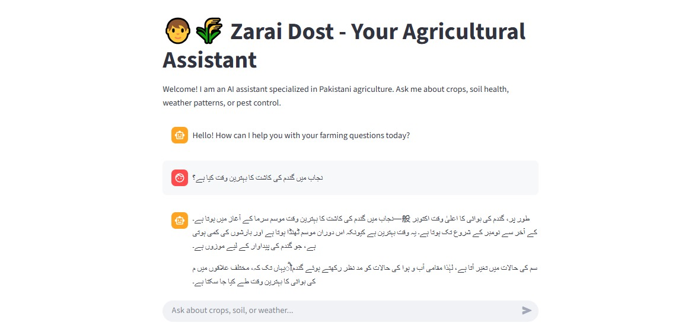

# 🌾 Agricultural Bot

An intelligent **Streamlit-powered chatbot** designed to assist farmers, students, and researchers with **agriculture-related queries** — from crop health and soil management to fertilizer recommendations.  
This project uses **Natural Language Processing (NLP)** and **AI models** to provide fast, reliable agricultural insights in a user-friendly interface.

---

## 🖼️ Screenshot

### 🌱 App Interface


> 📸 The screenshot file `agri.jpg` is located in the same folder as this README file.

---

## 🚀 Live Demo

Try it instantly online via Streamlit Cloud:  
👉 **[Agricultural Bot — Live App](https://agricultural-bot.streamlit.app/)**

---

## 🧩 Features

✅ AI-based chatbot for **agricultural questions**  
✅ Provides **crop, fertilizer, and pest control** information  
✅ Easy-to-use **web interface** built with Streamlit  
✅ Works on **desktop and mobile browsers**  
✅ Can be extended for **image-based plant disease detection**  
✅ Lightweight and ready to deploy  

---

## 🧠 Tech Stack

- **Python 3.10+**  
- **Streamlit** — frontend and UI  
- **Hugging Face Transformers / NLP Models** — chatbot responses  
- **Requests & JSON** — for data handling  
- **Pandas** — optional structured data analysis  

---

## ⚙️ Run Locally

You can run the Agricultural Bot locally by following these steps 👇

### 1️⃣ Clone the Repository

```bash
git clone https://github.com/ZainMushtaq9/Agricultural-Bot.git
cd Agricultural-Bot
